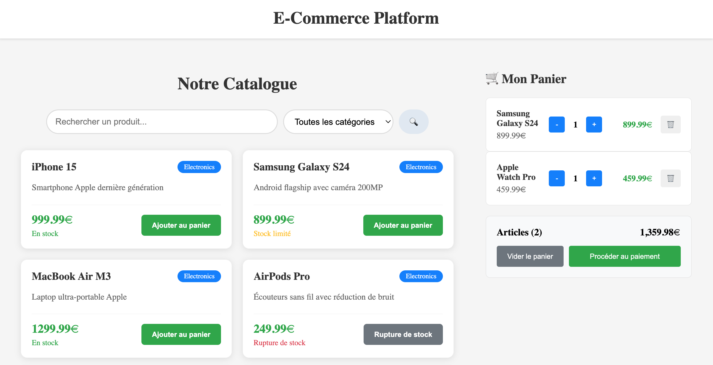
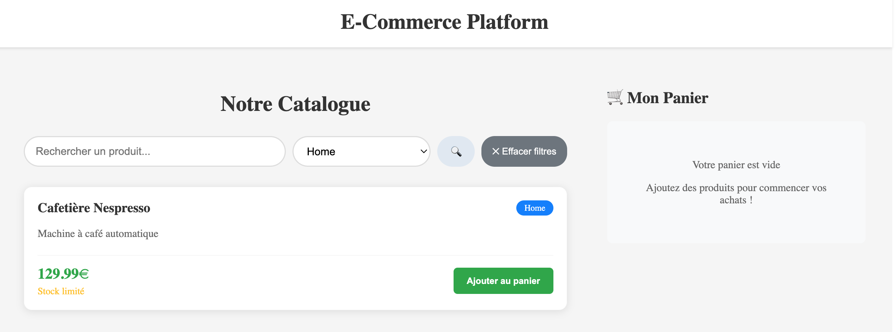

# 🛒 E-Commerce Platform

Application e-commerce complète développée avec **Spring Boot** et **Angular**.




## 🎯 Description

Plateforme e-commerce moderne avec gestion de catalogue, panier d'achat et interface administrative. 
Développée pour démontrer la maîtrise du développement full-stack Java/Angular.

## 🚀 Technologies utilisées

### Backend
- **Java 21** - Langage de programmation
- **Spring Boot 3.4** - Framework web
- **Spring Data JPA** - ORM et persistance
- **H2 Database** - Base de données en mémoire
- **Maven** - Gestionnaire de dépendances

### Frontend  
- **Angular 21** - Framework frontend
- **TypeScript** - Langage typé pour JavaScript
- **CSS3** - Styles et responsive design
- **RxJS** - Programmation réactive

## ✨ Fonctionnalités

### Catalogue produits
- ✅ Affichage en grille responsive
- ✅ Informations détaillées (nom, prix, stock, catégorie)
- ✅ Gestion des statuts de stock

### Recherche et filtrage
- ✅ Recherche par nom de produit
- ✅ Filtrage par catégories
- ✅ Interface intuitive avec reset des filtres

### Panier d'achat
- ✅ Ajout/suppression de produits
- ✅ Gestion des quantités avec contrôles +/-
- ✅ Calcul automatique du total
- ✅ Interface temps réel

### Architecture technique
- ✅ API REST complète avec validation
- ✅ Relations JPA entre entités
- ✅ Services métier avec logique business
- ✅ Interfaces TypeScript pour type safety
- ✅ Gestion d'état réactive avec BehaviorSubject

## 🛠️ Installation et lancement

### Prérequis
- Java 21+
- Node.js 20+
- Angular CLI 21

### Backend (Spring Boot)
```bash
# Cloner le projet
git clone https://github.com/AnhVaccari/e-commerce-platform.git
cd e-commerce-platform

# Lancer l'API
./mvnw spring-boot:run
```
L'API sera accessible sur `http://localhost:8080`

### Frontend (Angular)
```bash
# Dans un nouveau terminal
cd ecommerce-frontend
npm install
ng serve
```
L'interface sera accessible sur `http://localhost:4200`

## 📡 API Endpoints

| Méthode | URL | Description |
|---------|-----|-------------|
| GET | `/api/products` | Liste tous les produits |
| GET | `/api/products/search?name=...` | Recherche par nom |
| GET | `/api/products/category/{id}` | Produits par catégorie |
| GET | `/api/categories` | Liste des catégories |
| POST | `/api/products` | Créer un produit |

## 🎓 Objectifs d'apprentissage

Ce projet démontre la maîtrise de :
- **Développement full-stack** avec Spring Boot et Angular
- **Architecture en couches** (Entity, Repository, Service, Controller)
- **API REST** avec validation et gestion d'erreurs
- **Interface utilisateur moderne** et responsive
- **Gestion d'état** réactive côté frontend
- **Intégration** backend-frontend via HTTP

