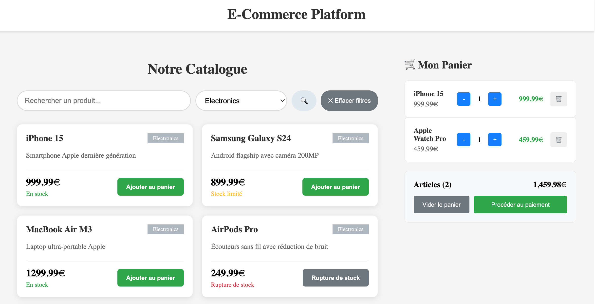
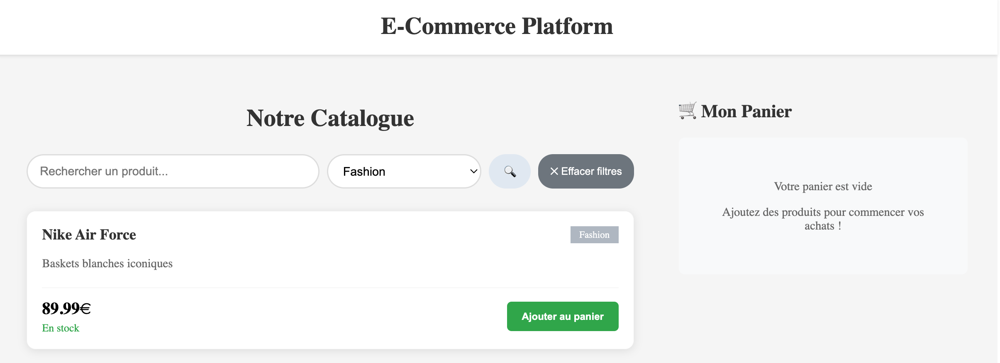

# E-Commerce Platform

Application e-commerce full-stack developpee avec **Spring Boot** et **Angular**.





## Description

Plateforme e-commerce avec authentification JWT, gestion de catalogue, panier d'achat, passage de commandes et interface d'administration.

## Technologies utilisees

### Backend
- **Java 21** - Langage de programmation
- **Spring Boot 3.4** - Framework web
- **Spring Security** - Authentification JWT
- **Spring Data JPA** - ORM et persistance
- **H2 Database** - Base de donnees en memoire
- **Maven** - Gestionnaire de dependances

### Frontend
- **Angular 21** - Framework frontend
- **TypeScript** - Langage type pour JavaScript
- **CSS3** - Styles et responsive design
- **Angular Signals** - Gestion d'etat reactive

## Fonctionnalites

### Authentification
- Inscription et connexion avec JWT
- Gestion des roles (USER / ADMIN)
- Protection des routes par role
- Intercepteur HTTP pour l'ajout automatique du token

### Catalogue produits (page d'accueil publique)
- Affichage en grille responsive
- Filtrage par categories
- Recherche de produits
- Ajout au panier sans authentification

### Panier d'achat
- Ajout/suppression de produits
- Gestion des quantites (+/-)
- Calcul automatique du total
- Persistance dans le localStorage
- Badge avec nombre d'articles dans la navbar

### Commandes
- Passage de commande depuis le panier
- Validation du stock cote serveur
- Reduction automatique du stock apres commande
- Page de confirmation avec numero de commande

### Dashboard Admin
- Vue d'ensemble avec statistiques
- Gestion des produits (CRUD complet)
- Gestion des utilisateurs
- Gestion des commandes et statuts

## Installation et lancement

### Prerequis
- Java 21+
- Node.js 20+
- Angular CLI 21

### Backend (Spring Boot)
```bash
# Cloner le projet
git clone https://github.com/AnhVaccari/e-commerce-platform.git
cd e-commerce-platform

# Lancer l'API
./mvnw spring-boot:run
```
L'API sera accessible sur `http://localhost:8080`

### Frontend (Angular)
```bash
# Dans un nouveau terminal
cd ecommerce-frontend
npm install
ng serve
```
L'interface sera accessible sur `http://localhost:4200`

### Comptes de test
| Role | Email | Mot de passe |
|------|-------|-------------|
| Admin | admin@ecommerce.com | admin123 |
| User | john@test.com | user123 |

## API Endpoints

### Authentification
| Methode | URL | Description |
|---------|-----|-------------|
| POST | `/api/auth/register` | Inscription |
| POST | `/api/auth/login` | Connexion |

### Produits
| Methode | URL | Description |
|---------|-----|-------------|
| GET | `/api/products` | Liste tous les produits |
| GET | `/api/products/{id}` | Produit par ID |
| GET | `/api/products/search?name=...` | Recherche par nom |
| GET | `/api/products/category/{id}` | Produits par categorie |
| POST | `/api/products` | Creer un produit |
| PUT | `/api/products/{id}` | Modifier un produit |
| DELETE | `/api/products/{id}` | Supprimer un produit |

### Categories
| Methode | URL | Description |
|---------|-----|-------------|
| GET | `/api/categories` | Liste des categories |

### Commandes
| Methode | URL | Description |
|---------|-----|-------------|
| GET | `/api/orders` | Toutes les commandes |
| GET | `/api/orders/{id}` | Commande par ID |
| GET | `/api/orders/user/{userId}` | Commandes d'un utilisateur |
| POST | `/api/orders` | Passer une commande |
| PUT | `/api/orders/{id}/status` | Modifier le statut |

### Utilisateurs
| Methode | URL | Description |
|---------|-----|-------------|
| GET | `/api/users` | Liste des utilisateurs |
| GET | `/api/users/{id}` | Utilisateur par ID |

## Architecture

```
e-commerce-platform/
├── src/main/java/                  # Backend Spring Boot
│   ├── config/                     # Security, JWT, CORS, DataInitializer
│   ├── controller/                 # REST Controllers
│   ├── dto/                        # Data Transfer Objects
│   ├── entity/                     # JPA Entities
│   ├── repository/                 # Spring Data Repositories
│   └── service/                    # Business Logic
├── ecommerce-frontend/src/app/     # Frontend Angular
│   ├── core/                       # Guards, interceptors, auth service
│   ├── features/
│   │   ├── admin/                  # Dashboard, products, users, orders
│   │   ├── auth/                   # Login, register
│   │   ├── cart/                   # Cart page
│   │   └── home/                   # Landing page (catalogue)
│   ├── services/                   # Cart, order services
│   └── interfaces/                 # TypeScript interfaces
```
